# linux基础
## linux系统目录结构
linux目录结构是**树形结构**
windows可以拥有**多个盘符**，如C、D、E盘(顶级目录可以有多个)
linux**没有盘符**的概念，只有**一个根目录/**，所有文件都在它下面

在linux中，路径之间的层级关系，使用**反斜杠**`\`表示
* `D:\backup\notebook\C`
  * `D:`表示D盘
  * `\`表示层级关系

在windows中，路径之间的层级关系，使用**斜杠**`/`表示
* `/user/local/hello.txt`
  * 开头的`/`表示根目录
  * 后面的`/`表示层级关系

## linux命令基础
Linux命令，本体是一个个**二进制可执行程序**

通用格式:
`command [-options] [parameter]`
* conmand：命令本身
* -options：[可选]命令的一些选项，可以通过选项控制命令的行为细节
* parameter：[可选]命令的参数，多数用于命令的指向目标

### ls命令
ls命令作用：列出目录下的内容
`ls [-a -1 -h] [Linux路径]`
* -a -l -h是**可选**的选项
* Linux路径是此命令**可选**的参数

* 当不使用选项和参数，直接使用ls命令本体，表示以**平铺**形式，列出**当前工作目录下**的内容
* 当使用参数，ls命令的参数表示：指定一个linux路径，列出指定路径的内容

选项：
* -a选项，表示：all，即列出全部文件（包含隐藏的文件、文件夹——以.开头）
* -l选项，表示：list，以**列表**的形式展示内容，并显示更多信息
* -h选项，以易于阅读的形式，列出文件大小，如K、M、G，
  注意：**-h与-l是绑定的**，-h不能单独使用

ls命令选项组合使用方法：（以下三种方式的相等）
* ls -l -a
* ls -la
* ls -al

HOME目录：
每个Linux操作用户在Linux系统的**个人账户目录**，路径在`/home/用户名`

### 目录切换相关命令(cd/pwd)
linux终端打开时，会默认以用户的HOME目录作为当前工作目录，可通过cd更改当前所在的工作姆露露

cd——Change Directory
作用：切换工作目录
语法：`cd [Linux路径]`
* cd命令无需选项，只有参数，表示要切换到哪个目录下
* cd命令直接执行，不写参数，表示回到用户的HOME目录

通过ls来验证当前工作目录是不恰当的
pwd——Print Work Directory
作用：查看当前所在的工作目录
语法：`pwd`
* pwd命令，无选项，无参数
 
 ### 绝对路径和相对路径
绝对路径：以**根目录为起点**，描述路径的一种写法，路径描述以`/`开头
相对路径：以**当前目录为起点**，描述路径的一种写法，路径描述无需以/开头
若无特殊需求，常使用相对路径

特殊路径符：
- . 表示**当前目录**，如`cd ./Desktop`表示切换到当前目录下的Desktop目录内，和`cd Desktop`效果一致
- ..表示**上一级目录**，如`cd ..`可切换到上一级目录，`cd ../..`切换到上二级目录，`cd ../../..`退回三级
- ~ 表示**HOME目录**，如`cd ~`即可切换到HOME目录，`cd ~/Desktop`切换到HOME目录下的Desktop目录

### 创建目录命令mkdir
mkdir——Make Directory
作用：通过mkdir命令可以创建新的**目录（文件夹）**
语法：`mkdir [-p] Linux路径`
- 参数**必填**，表示linux路径，即要创建的文件夹的路径，绝对路径或相对路径均可
- -p**可选**，表示自动创建不存在的父目录，适用于创建连续多层级的目录

注意：创建文件夹需要修改权限，尽量确保均在HOME目录内，不要在HOME外操作，否则将涉及权限问题，导致创建不成功

### touch、cat、more
> touch命令

作用：创建**文件**
语法：`touch Linux路径`
- touch命令无选项，参数必填，表示要创建的文件路径，相对、绝对、特殊路径均可以使用

> cat命令

作用：查看文件内容
语法：`cat Linux路径`
- cat没有选项，参数必填，参数表示被查看的文件路径，相对、绝对、特殊路径均可使用

> more命令

作用：查看文件内容，但与cat不同：
- cat直接将内容全部显示出来
- more支持**翻页**，若文件内容过多，可以一页一页显示

语法：`more Linux路径`
- 没有选项，参数必填，参数表示：被查看的文件路径，绝对、相对、特殊路径符都可使用
- 查看过程中：按**空格**翻页，按q退出查看


### cp、mv、rm
cp——copy
作用：赋值文件/文件夹
语法：`cp [-r] 参数1 参数2`
- -r选项，可选，用于复制文件夹使用，表示递归
- 参数1，Linux路径，表示被复制的文件或文件夹
- 参数2，Linux路径，表示要赋值去的位置

mv——move
作用：移动文件/文件夹
语法：`mv 参数1 参数2`
- 参数1，Linux路径，表示被移动的文件或文件夹
- 参数2，Linux路径，表示要移动去的地方，
  若目标不存在，则进行**改名**，确保目标存在

rm——remove
作用：删除文件/文件夹
语法：`rm [-r -f] 参数1 参数2 ...参数N`
- -r选项，用于删除文件夹
- -f选项，即force，强制删除（不会弹出提示确认信息）
  - 普通用户删除内容不会弹出提示，只有root管理员用户删除内容会有提示
  - 所以一般用户用不到-f选项
- 参数1、参数2、...参数N 表示要删除的文件或文件夹路径（可同时删除多个文件），按照空格隔开

rm命令支持通配符`*`，用来做模糊匹配
- 符号`*`表示通配符，即匹配任意内容（包含空）
  - `test*`，表示匹配任何以test开头的内容
  - `*test`，表示佩佩任何以test结尾的内容
  - `*test*`，表示匹配任何包含test的内容

注意：rm命令十分危险，特别是处于root（超级管理员）用户的时候，应谨慎使用
如以下命令应在root用户下禁用：
- `rm -rf /`
- `rm -rf /*`
该两行命令作用等同于格式化硬盘

补：进入root模式
- 输入命令`su - root`
- 再输入密码即可进入root模式
- 若要退出，则输入`exit`

### which和find
which命令
Linux命令，本质上是二进制可执行文件
作用：查看所使用**命令**的程序文件的位置
语法：`which 要查找的命令`

find命令
按文件名查找**文件**
语法：`find 起始路径 -name "被查找文件名"`

find命令也支持通配符`*`来做模糊匹配
- 如`find / -name "*test*"`
  Tips：ctrl+c可停止查找

按文件大小查找文件
语法：`find 起始路径 -size +/-n[kMG]`
- +、-表示大于和小于
- n表示大小数字
- kMG表示大小单位，仅写一个，k（小写）表示kb（即1B），M表示MB，G表示GB
- 如`find / -size +10k`

### grep和wc
grep命令：
作用：从**文件**中，通过关键字过滤文件行
语法：`grep [-n] 关键字 文件路径`
- 选项-n，可选，表示在结果中显示匹配行的行号
- 关键字，必填，表示过滤的关键字，建议用""将关键字包围（如有空格或其他特殊符号）
- 文件路径，必填，表示要过滤内容的文件路径，**可作为内容输入端口**

wc命令：
作用：统计文件的行数、单词数量、字符数量
语法：`wc [-c -m -l -w] 文件路径`
- -c，可选，统计byte数量
- -m，可选，统计字符数量
- -l，可选，统计行数
- -w，可选，统计单词数量
- 文件路径，必填，被统计的文件，**可作为内容输入端口**

管道符：`|`
作用：将管道符左边命令的结果，作为右边命令的输入(只要能产生内容输入的命令，都可以与管道做配合)
如`cat ~/test.txt | grep "long"`

### echo、tail、重定向符>
echo命令
作用：在命令行内输出指定内容
语法：`echo 输出的内容`
- 无需选项，只有一个参数，表示要输出的内容，复杂内容可以用" "包围
- 如在终端上显示：hello linux：`echo hello linux`
- 带有空格或\等特殊符号，建议用双引号包围
  因为不包围的话，空格容易被人误解为参数2

反引号:\`
作用：被\`包围的内容，会被作为命令执行，而非普通字符
如：
```
  echo `pwd`
```

重定向符：
- \>，将左侧命令的结果，**覆盖**写入到符号右侧指定的**文件**中
- \>>，将左侧命令的结果，**追加**写入到符号右侧指定的**文件**中

注意：会自动换行
如：
`echo "Hello Linux" > test.txt`
`echo "Hello Linux" >>test.txt`
`ls > test.txt`

tail命令：
作用：可以查看文件尾部内容，跟踪文件尾部的更改
语法：`tail [-f -num] Linux路径`
- -f选项，可选，即follow，表示持续跟踪
- -num，可选，表示查看尾部多少行，不填则默认10行
- 参数Linux路径，表示被跟踪的文件路径

Tips：使用-f跟踪后，可通过ctrl+c强制终止

### vi/vim编辑器
vi/vim即visual interface，linux最经典的文本编辑器，vi是命令行下对文本文件进行编辑的绝佳选择
vim是vi的加强版本，兼容vi所有指令，不仅能  编辑文本，还具有shell程序编辑功能

vi/vim三种工作模式：
- 命令模式(Command mode)：所敲的按键都将被编辑器理解为**命令**，以命令驱动执行不同的功能
  此模式下，不能自由进行文本编辑
- 输入模式(Insert mode)：即编辑模式、插入模式。此模式下，可对文件内容进行自由编辑
- 底线命令模式(Last line mode)：以`:`开始，通常用于文件的保存、退出

进入vi/vim：
`vi 文件路径`
`vim 文件路径`
- 如果文件路径表示的文件**不存在**，则此命令用于**编辑新文件**
- 如果文件路径表示的文件**存在**，则此命令用于**编辑已有文件**
- 默认情况下，进入**命令模式**，通过快捷键可切换至输入模式或底线命令模式，输入模式与底线命令模式不互通

常用快捷键：
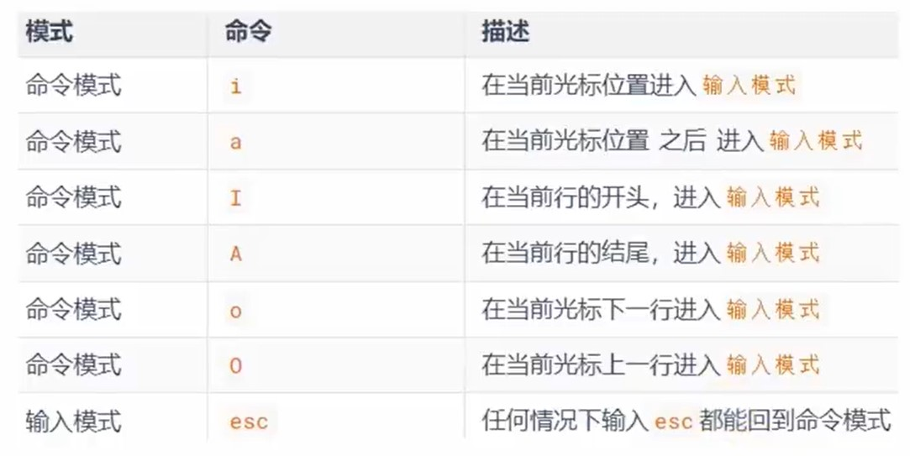
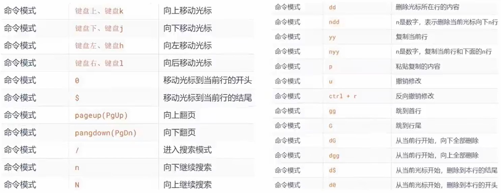

### root用户
windows、MacOS、Linux均采用多用户管理模式进行权限管理
- 在Linux系统中，拥有最大权限的账户名为**root(超级管理员)**
- root用户拥有最大的系统操作权限，而普通用户在许多地方的权限是受限的
  - 普通用户的权限，一般在其HOME目录内是不受限的
  - 一旦出了HOME目录，大多数地方，普通用户仅有只读和执行权限，无修改权限

su和exit命令：
su——Switch User，属于系统命令
作用：切换账户
语法：`su [-] [用户名]`
- -，可选，表示是否在切换用户后加载环境变量，**建议带上**
- 用户名，可选，表示要切换的用户，若省略则表示默认切换到root
- 切换用户后，可以通过**exit命令**退回上一个用户，也可以使用快捷键ctrl+d

注意：
- 使用普通用户，切换到其他用户**需要输入密码**
- 使用root用户切换到其他用户，**无需密码**

sudo命令：
不建议长期使用root用户，避免带来系统损坏
但是可以使用sudo命令，为普通的命令授权，临时以root身份执行

语法：`sudo 其他命令`
- 并不是所有用户，都有权利使用sudo，**需要为普通用户配置sudo认证**

为普通用户配置sudo认证
- 切换到root用户，执行`visudo`命令，会自动通过vi编辑器打开：`/etc/sudoers`
- 在文件的**最后**添加：
  `用户名 ALL=(ALL)     NOPASSWD:ALL`
  其中最后的NOPASSWD:ALL表示使用sudo命令，无需输入密码
- 最后通过wq保存
- 切换回普通用户
- 该用户执行的sudo命令，则会以root运行

## 用户和用户组
linux系统中可以：
- 配置多个用户
- 配置多个用户组
- 用户可以加入多个用户组中

linux中关于权限的管控级别有两个级别：
- 针对用户的权限控制
- 针对用户组的权限控制

如针对某文件，可以控制用户的权限，也可以控制用户组的权限

### 用户组管理
注意：以下命令需要**root用户**执行
- 创建用户组
  `groupadd 用户组名`
- 删除用户组
  `groupdel 用户组名`

### 用户管理
注意：以下命令需要root用户执行
- 创建用户
  `useradd [-g -d] 用户名`
  - -g，可选，指定用户的组，
    若不指定-g，则会创建同名组并自动加入，
    指定-g需要组已经存在，如已存在同名组，必须使用-g
  - -d，可选，指定用户HOME路径，不指定则默认创建其HOME目录在:`/home/用户`
- 删除用户
  `userdel [-r] 用户名`
  - -r，删除用户的HOME目录，不使用-r时，删除用户将保留其HOME目录
- 查看用户所属组
  `id [用户名]`
  - 用户名，可选，为被查看的用户，如果不提供则查看当前用户
- 修改用户所属组
  `usermod -aG 用户组 用户名`
  将指定的用户加入指定的用户组

### getent
作用：查看当前系统中有哪些用户或组
语法：
- `getent passwd`查看系统全部**用户**信息
  查看的内容一共有7份信息：
  `用户名:密码(显示为x):用户ID:组ID:描述信息(无用):HOME目录:执行终端(默认bash)`
- `getent group`查看系统全部**组**信息
  查看的内容包含三份信息：
  `组名称:组认证(显示为x):组ID`

### 权限控制信息
通过`ls -l`可以用列表形式查看内容，并显示权限细节：
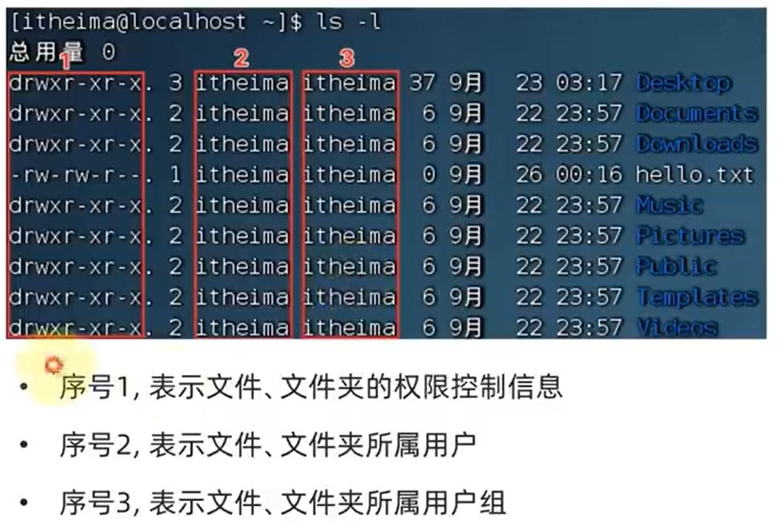

权限信息：
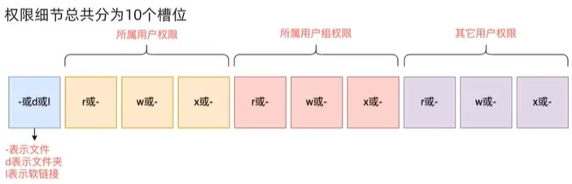
后面9位中，`-`表示无此权限

rwx
- r,read,即读权限
- w,write,即写权限
- x,execute,即执行权限

针对文件、文件夹的不同，rwx的含义有细微差别：
- r
  针对文件，可以查看文件内容
  针对文件夹，可以查看文件夹内容
- w
  针对文件，表示可以修改此文件
  针对文件夹，可以在文件夹内：创建、删除、改名等
- x
  针对文件，可以将文件作为程序执行
  针对文件夹，可以更改工作目录到此文件夹，即cd进入

### chmod命令
作用：修改文件、文件夹的权限信息
注意：只有文件、文件夹的**所属用户**或**root用户**可以修改
语法：`chmod [-R] 权限 文件或文件夹`
- -R，可选，表示对文件夹内的全部内容应用同样的操作

示例：`chmod u=rwx,g=rx,o=x hello.txt`
解释：u即修改user用户权限，g即修改组(group)权限，o即修改其他(other)权限

 权限的数字符号：
 r记为4，w记为2，x记为1
 - 0：无任何权限，即`---`
 - 1：仅有x权限，即`--x`
 - 2：仅有w权限，即`-w-`
 - 3：有w和x权限，即`-wx`
 - 4：仅有r权限，即`r--`
 - 5：有r和x权限，即`r-x`
 - 6：有r和w权限，即`rw-`
 - 7：有全部权限，即`rwx`

### chown命令
作用：修改文件、文件夹的所属用户和用户组
注意：普通用户无法修改所属为其他用户或组，此命令只适用于**root用户**执行
语法：`chown [-R] [用户] [:] [用户组] 文件或文件夹`
- -R，可选，表示对文件夹内部全部内容应用相同规则
- 用户，可选，修改所属用户
- `:`，可选，用于分隔用户和用户组，无该符号则默认修改的是所属用户
- 用户组，可选，修改所属的用户组

示例：
- `chown root hello.txt`，将hello.txt所属用户修改为root
- `chown :root hello.txt`，将hello.txt所属用户组修改为root
- `chown root:user1 hello.txt`，将hello.txt的所属用户修改为root，用户组修改为user1

## linux实用操作
### 快捷键
`ctrl+c`强制停止
- linux某些程序的运行，可以强制停止
- 输入命令错误，ctrl+c即退出当前出入

`ctrl+d`退出或登出
- 退出账户的登录
- 退出某些特定程序的专属页面
  注意：不能用于退出vi/vim

`history`命令，查看历史输入过的命令
- 可以联合grep过滤
- 最大的作用是找到以前的命令去复制粘贴

`!命令前缀`,自动执行上一次匹配前缀的命令
  如：!py，即从后往前找到输入命令中第一个匹配的命令并执行，注意：不宜用于寻找太久以前的命令

`ctrl+r`输入内容去匹配历史命令（从后往前）

光标移动：
- `ctrl+a`跳到命令开头
- `ctrl+e`跳到命令结尾
- `ctrl+键盘左键`向左跳一个单词
- `ctrl+键盘右键`向右跳一个单词

`ctrl+l`清屏
- 可以清楚终端的内容
- 也可以通过`clear`命令得到同样的效果

### linux系统软件安装
软件安装的常用方式：
- 下载安装包自行安装
- 系统的应用商店内安装

linux同样支持这两种方式

CentOS使用`yum`命令安装软件：
yum：RPM包软件管理器，用于自动化安装配置linux软件，可以自动解决依赖问题
注意：yum命令需要**root权限**，也需要**联网**
语法：`yum [-y] [install / remove / search] 软件名称`
- -y，可选，表示自动确认，无需手动确认安装或卸载过程
- install，可选，安装
- remove，可选，卸载
- search，可选，搜索
示例：`yum install -y ntp`

Ubuntu使用`apt`命令安装软件：
apt：DEB包软件管理器
语法：`apt [-y] [install / remove / search] 软件名称`

### systemctl命令
linux内很多软件（内置或第三方）均支持使用systemstl命令控制启动、停止、开机自启
能够被systemctl管理的**软件**，一般也称为**服务**
语法：`systemctl start / stop / status /enable / disable 服务名`
- start，启动
- stop，关闭
- status，查看状态
- enable，开启开机自启
- disable，关闭开机自启

系统内置服务很多，如：
- NetworkManager，主网络服务
- network，副网络服务
- firewalld，防火墙服务
- sshd，ssh服务

对于第三方软件：
部分软件安装后会自动集成到systemctl中
对于安装后没有自动集成到systemctl中的软件，可以手动添加

### 软链接
作用：可以将文件、文件夹链接到其他位置（类似windows系统中的快捷方式）
语法：`ln -s 参数1 参数2`
- -s，创建软连接
- 参数1，被链接的文件或文件夹
- 参数2，要链接去的目的地

示例：
`ln -s /etc/yum.comf ~/yum.conf`
`ln -s/etc/yum ~/yum`

### 日期和时区
> date命令

作用：查看系统时间
语法：`date [-d] [+格式化字符串]`
- -d，可选，按照给定的字符串显示日期，一般用于日期计算
- 格式化字符串：通过特定的字符串标记，来控制显示的日期格式
  - %Y 年
  - %y 年份后两位数字(00-99)
  - %m 月份(01-12)
  - %d 日(01-31)
  - %H 小时(00-59)
  - %M 分钟(00-59)
  - %S 秒(00-60)
  - %s 自1970-01-01 00:00:00 UTC到现在的秒数（即**时间戳**）

示例：
- `date`使用date命令本体，无选项，直接查看时间
- `date +%Y-%m-%d`按照2022-01-01格式显示日期
- 按照2022-01-01 10:00:00格式显示日期：
  `date +%Y-%m-%d %H:%M:%S`错误的格式
  `date "+%Y-%m-%d %H:%M:%S`由于中间带有空格，所以使用双引号包围格式化字符串，使之成为整体

-d选项可以按照给定的字符串显示日期，一般用于日期计算（该选项可以配合格式化字符串使用）
其中支持的时间标记为：
- year 年
- month 月
- day 天
- hour 小时
- minute 分钟
- second 秒

示例：
`date -d "+1 day"`
`date -d "-3 month" +%Y-%m-%d`
`date -d "+1 year"`

> 修改linux时区：

注意：需要**root权限**才能修改时区
示例：修改时区为东八时区：
`rm -f /etc/localtime`
`sudo ln -s /usr/share/zoneinfo/Asia/Shanghai /etc/localtime`

> ntp程序

作用：自动定期校准系统时间（需要联网）
安装ntp：`yum -y install ntp`
启动并设置开机自启：
- `systemctl start ntpd`
- `systemctl enable ntpd`
也可以手动校准（**需要root权限**）：`ntpdate -u ntp.aliyun.com`

### IP地址和主机名
IP地址：
- v4版本
- v6版本

查看方式：`ipconfig`

特殊IP：
- `127.0.0.1`，指代本机
- `0.0.0.0`
  - 可用于指代本机
  - 可在端口绑定中用来确定绑定关系
  - 在一下IP地址限制中，表示所有IP，如放行规则设置为0.0.0.0，表示允许任意IP访问

主机名：每一台电脑除了对外联络地址(IP地址)以外，也可以有一个名字，称主机名  
查看主机名：`hostname`  
修改主机名（需要root权限）：`hostnamectl set-hostname`  

域名解析：
1. 先查看本机的记录
   - Windows查看：`C:\Windows\System32\drivers\etc\hosts`
   - Linux查看：`/etc/hosts`
2. 本机没有，则联网查看DNS服务器  
配置主机名映射：
- Windows系统：
  1. 管理员运行记事本
  2. 打开hosts文件
  3. 配置格式：另起一行，输入`192.168.14.3 centos`

### 配置Linux固定IP地址
为什么要配置固定IP：  
当前虚拟机linux的IP是通过DHCP服务获得的，可能导致每次重启后IP地址频繁变更
- 远程连接修改适配很麻烦
- 更新IP与主机名的映射很麻烦

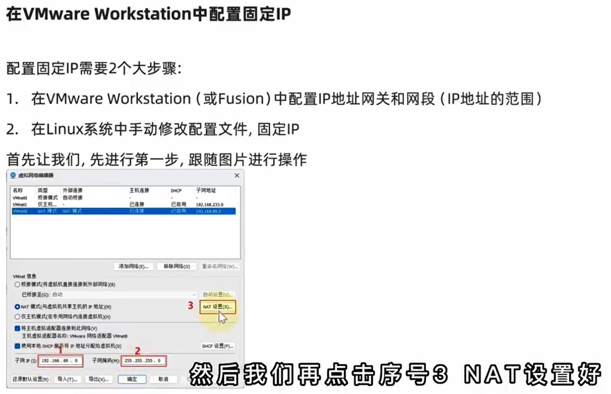
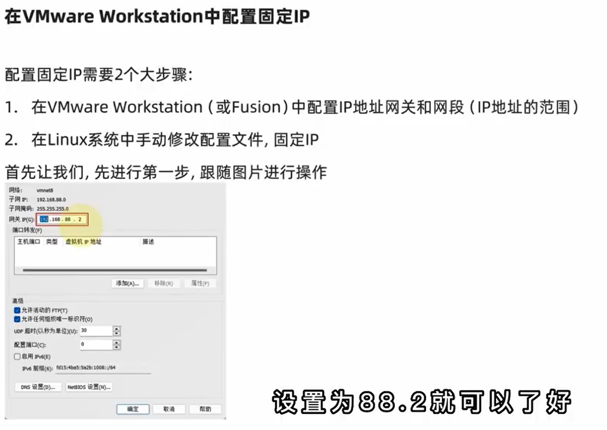
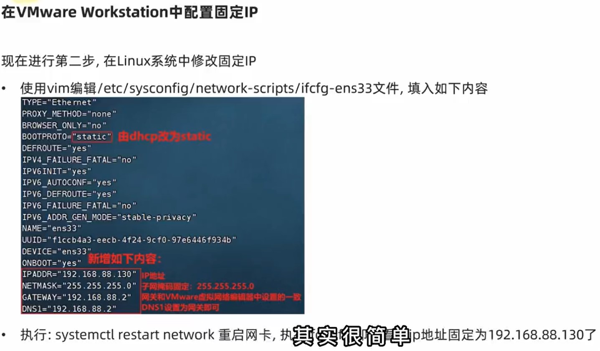


### 网络请求和下载——Ping、Wget、curl
ping命令
作用：检查指定的网络服务器是否联通
语法：`ping [-c num] ip或主机名`
- -c，可选，后面的num表示检查次数，不使用-c将**无限次数**持续检查
- ip或主机名，被检查的服务的ip地址或主机名地址

示例：
`ping baidu.com`  
`ping -c 4 192.168.14.8`

wget命令：
作用：非交互式文件下载器，可实现在命令行内下载网络文件  
语法：`wget [-b] url`  
- -b，可选，表示后台下载，会将日志写入到当前工作目录的wget-log文件中  
  可使用tail命令跟踪后台下载进度：`tail -f wget-log`
- url，下载链接

注意：无论下载是否完成，都会生成要下载的文件，若下载未完成，需要**及时手动清理**未完成的不可用文件

curl命令：
作用：发送http网络请求，可用于下载文件、获取信息等
语法：`curl [-O] url`
- -O，可选，用于下载文件，当url是下载链接时，可以使用此选项保存文件
- url，要发起请求的网络地址

### 端口
端口：
- 物理端口
- 虚拟端口
  通过IP只能锁定计算机，但无法锁定具体程序  
  通过端口可以锁定计算机上具体的程序，确保程序之间进行沟通  

端口分类：
- 公认端口1-1023：用于系统内置或知名程序的预留使用，建议不要占用该范围的端口（SSH-22，HTTPS-443）
- 注册端口1024-49151：通常可以随意使用，用于松散绑定的一些程序/服务
- 动态段鸥49152-65535：通常不会绑定程序，而是程序对外进行网络链接时临时使用

nmap命令：  
使用前提：需要先安装namp：`yum -y install nmap`  
作用：查看端口的占用情况
语法：`namp IP地址`

示例：  
`nmap 127.0.0.1`查看本机端口占用情况  

netstat命令：
前提：安装netstat：`yum -y install net-tools`  
作用：联合`grep xx`，查看当前系统的xx端口被哪个程序占用（其实可以过滤任意关键字，不仅仅是端口号）  
语法：`netstat -anp | grem 端口号`

### 进程管理
 ps命令：  
 作用：查看Linux系统中的进程信息  
 语法：`ps [-e -f]`  
 - -e，显示出全部的进程
 - -f，以完全格式化的形式展示信息（展示全部信息）

显示参数解读：
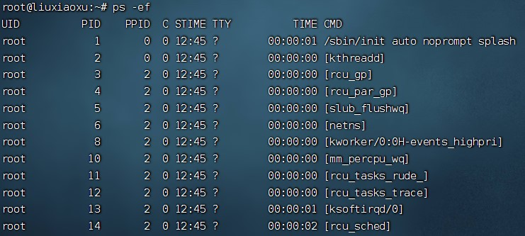
- UID 进程所属用户ID
- PID 进程的进程号ID
- PPID 进程的父进程ID
- C 此进程的CPU占用率
- STIME 进程的启动时间
- TTY 启动此进程的终端序号（显示`?`则表示非终端启动）
- TIME 进程占用CPU的（总）时间
- CMD 进程对应的命令名称或启动路径或启动命令

注意：可以通过grep命令过滤关键信息

kill命令：
作用：关闭进程  
语法：`kill [-9] 进程ID`  
- -9,强制关闭进程

### 主机状态监控
查看系统资源占用  
top命令  
作用：查看CPU、内存使用情况（默认每5秒刷新一次）  

top命令内容解释：
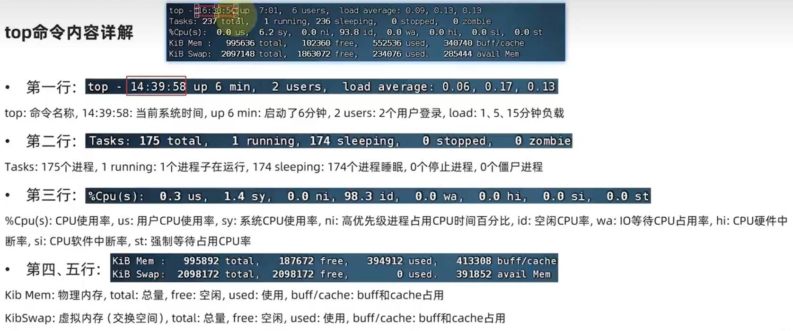
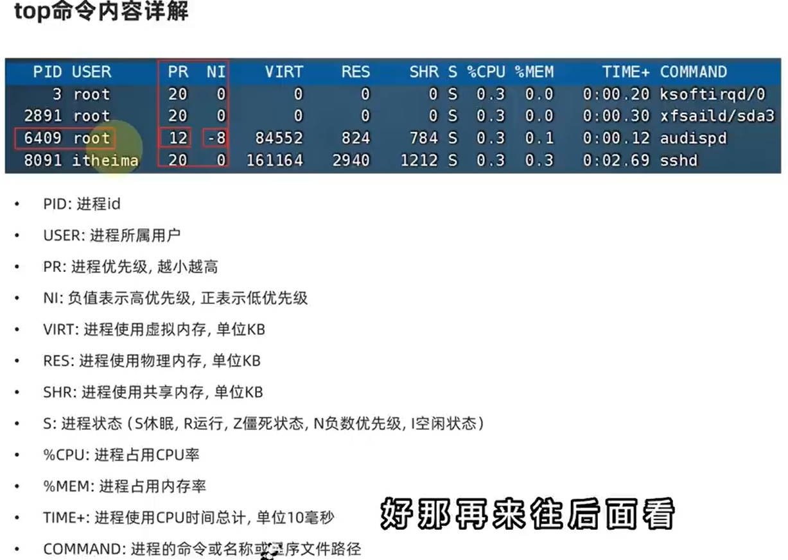

top命令选项：
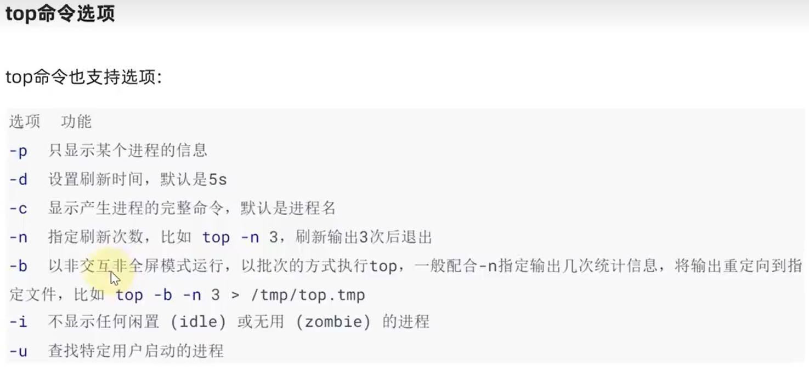

top交互式选项：
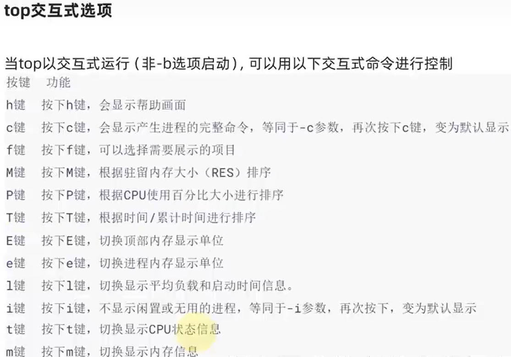


磁盘信息监控  
df命令：  
作用：查看硬盘上使用情况
语法：`df [-h]`
- -h，以更加人性化的单位显示

iostat命令：  
作用：查看CPU、磁盘相关信息  
语法：`iostat [-x] [num1] [num2]`
- -x，显示更多信息
- num1，数字，刷新间隔
- num2，数字，刷新次数

iostat内容解释：
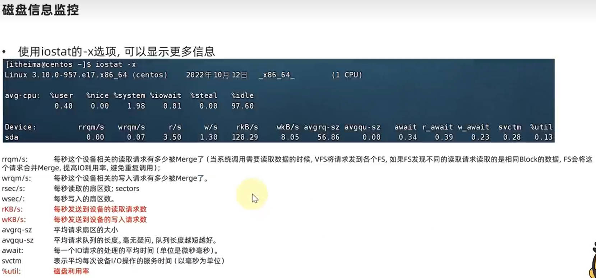

网络状态监控  
可以使用sar命令查看网络相关统计
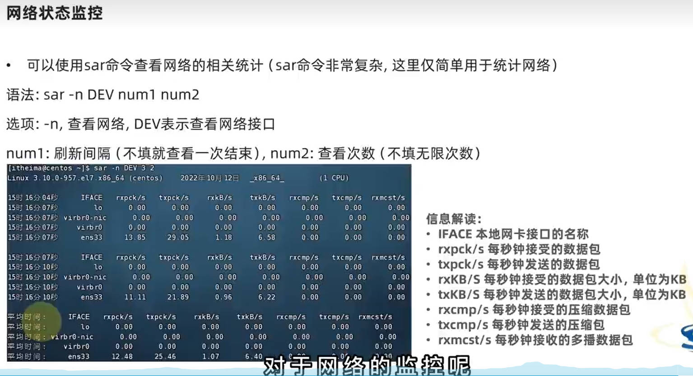

### 环境变量
环境变量：OS在运行时，记录的一些关键性信息，用以辅助系统运行  
环境变量是一种`Key=Value`型结构

env命令  
作用：查看当前系统中记录的环境变量

环境变量：PATH  
PATH记录了系统执行任何命令的**搜索路径**，路径之间以`:`隔开  
执行任何命令，都会按照顺序，从这串路径中搜索要执行的程序本体  

`$`符号  
作用：取变量的值
语法：`$环境变量名`  
`echo $环境变量名`显示该环境变量的值  
`echo ${PATH}ABC`当和其他内容混在一起时，可通过`{}`来标注取的变量是谁

自行设置环境变量：
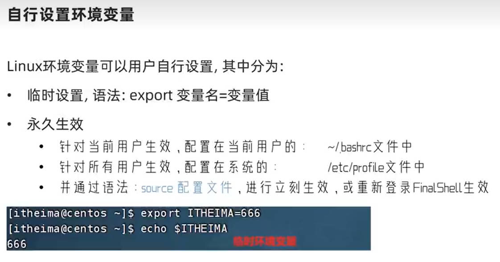

自定义环境变量PATH  
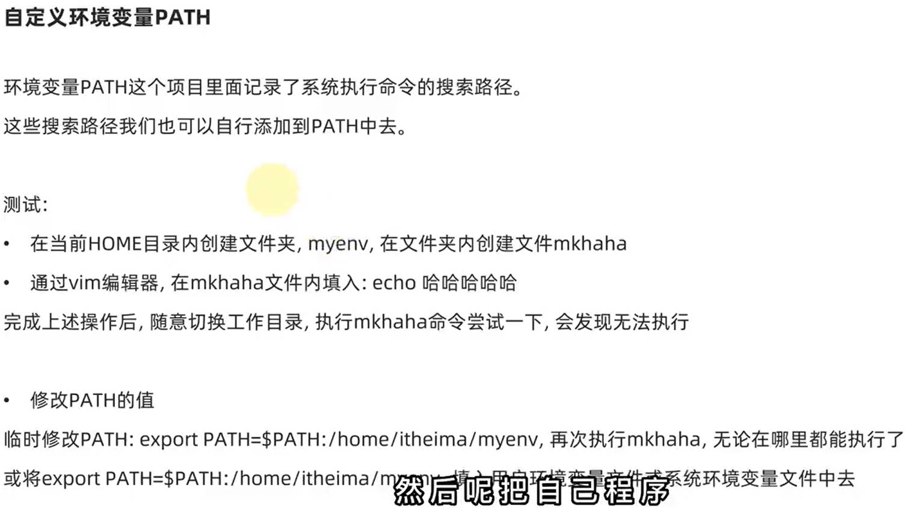

### linux文件的上传和下载
通过FinalShell工具：
- 浏览文件系统，找到合适文件，右键点击下载，即可传输到本地电脑
- 浏览文件系统，找到合适目录，将本地电脑的文件拓展进入，即可传输到linux

注意：  
FinalShell需要以适合的权限去登录才能访问一些文件夹  
文件自动下载到桌面的fsdowload文件夹中  

rz、sz命令
安装rz、sz命令：`yum -y install lrzsz`  
- rz命令语法：`rz`
- sz命令语法`：sz 要下载的文件`

### 压缩和解压
常见压缩格式：
- zip格式：linux、Windows、MacOS常用
- 7zip：Windows常用
- rar：Windows常用
- tar：Linux、MacOS常用
- gzip：Linux、MacOS常用

Linux和Mac常用两种压缩格式：
- `.tar`，即`tarball`，归档文件：简单的将文件组装到一个.tar文件内，并没有恩爱多文件体积的减少，仅仅是简单封装
- `.gz`，常见为`.tar.gz`，`gzip`格式压缩文件，即用gzip压缩算法压缩到一个文件内，可极大减少压缩后的体积  

tar命令
语法：`tar [-c -v -x -f -z -C] 参数1 参数2 ... 参数N`  
- -c，创建压缩文件，用于**压缩模式**
- -v，显示压缩、解压过程，用于查看进度
- -x，**解压模式**
- -f，要创建的文件，或要解压的文件，**-f选项必须在所有选项中位置处于最后一个**（因为其后面接一个参数，即表示要处理的文件）
- -z，gzip模式，不使用-z即默认tarball格式
- -C，选择解压的目的地，用于解压模式

tar命令压缩常用组合
- `tar -cvf test.tar 1.txt 2.txt 3.txt`将1.txt 2.txt 3.txt压缩到test.tar文件中
- `tar -zcvf test.tar 1.txt 2.txt 3.txt`将1.txt 2.txt 3.txt压缩到test.tar.gz文件中（使用gzip模式）

注意：
- -z选项使用时，一般处于选项位**第一个**
- -f选项，必须在选项为**最后一个**

tar命令解压常用组合
- `tar -xvf test.tar`解压test.tar，将文件解压到当前目录
- `tar -xvf test.tar -C /home/itheima`解压test.tar，将文件解压至指定目录/home/itheima
- `tar -zxvf test.tar.gz -C /home/itheima`以gzip模式解压test.tar.gz，将文件解压值指定目录/home/itheima

注意：
- -f选项必须在**第一位**
- -z选项建议在**开头位置**
- -C选项建议**单独使用**，即和解压所需的其他参数分开

zip命令
语法：`zip [-r] 参数1 参数2 ... 参数N`  
- -r表示压缩的资源中包含文件
- 参数1，表示压缩文件的文件路径
- 参数2-N，表示被压缩文件的文件路径

uzip命令  
语法：`uzip [-d] 参数`  
- -d，指定要解压到的位置，同tar命令的-C选项
- 参数，被解压的zip压缩包文件路径  

