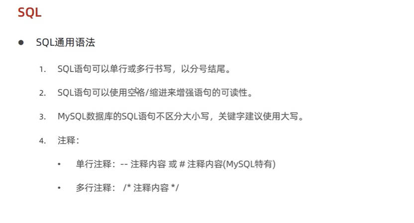
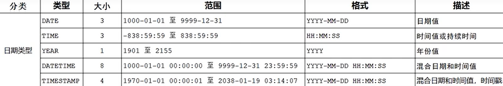

# mysql基础

## 目录
[TOC]

## [mysql概述与基础](#目录)
### [mysql服务](#目录)
启动与停止：
注意需要在**管理员模式**下启动windows命令行
- 启动
  `net start mysql80`
- 停止
  `net stop mysql80`

客户端连接
注意前提是**mysql服务启动**
- 方法一：MySQL提供的客户端命令行工具 
- 方法二：利用命令行工具执行`mysql [-h 127.0.0.1] [-P 3306] -u root -p`
  - 省略可选项，则表示连接本地
  - -h选项指定连接一个ip
  - -p选项指定连接一个端口
  - -u表示指定用户
  - -p表示指定密码
  
### [mysql数据模型](#目录)
数据库分类：
- 关系型数据库  
  概念：建立在**关系模型**的基础上，由多张相互连接的**二维表**组成的数据库  
  特点：
  - 使用表存储数据，格式统一，便于维护
  - 使用SQL语言操作，标准统一，使用方便
- 非关系型数据库


### [mysql通用语法及分类](#目录)



### DDL 
DDL数据库操作

  - 字符集不建议使用utf8，建议utf8mb4

DDL表操作
- 注意每个字段用`,`分隔，最后一个字段后面没有逗号
- `[]`可选注释语法：`comment '注释'`


DDL数据类型
- 数据类型
- 字符串类型
- 日期类型




DDL表操作-修改


DDL表操作-删除


### DML
DML添加数据


DML修改数据
- where条件选项格式示例：`where id=1`
- 条件不能为多个，但修改的字段可以是多个


DML删除数据


### DQL
DQL查询数据


- 虽然使用通配符`*`可以进行所有字段的查询，但是实际开发中不建议使用通配符（不直观）
- 起别名时，其实可以省略`as`，注意别名建议用`''`括起来（也可以不括）

DQL条件查询


- between后跟**最小值**，end后跟**最大值**
- `is null`也可接逻辑运算符变为`is not null`


DQL聚合函数

- count的字段列表可使用通配符`*`，表示统计整个表，  
  使用单个字段，可能导致统计不完全（不统计null）
- 使用聚合函数的同时也可以使用条件查询
- 聚合函数统计的列名，也可以使用别名，如`select gender 性别,count(*) 统计结果 from employee group by gender;`

DQL分组查询


示例：  
查询年龄小于45岁的员工，并根据工作地址分组，获取员工数量大于等于3的工作地址  
`select workaddress,count(*) adress_count from emp where age <45 group by workaddress having address_count >=3;`  

DQL排序查询


DQL分页查询


DQL执行顺序
- 编写顺序!=执行顺序


DQL语句总结


### DCL
DCL介绍


DCL用户管理


DCL权限控制


- 注意前面的不是用户名，而是`数据库名.表名`，不需要用`''`括起来
- 撤销是from，不是to

DLC总结


```shell
show tables ;
desc employee;

insert into employee values(1,'张三','男',18,123456789012345678,'2023-02-19');
insert into employee(id,name,gender,age) values(2,'李四','男',19),
                                               (3,'王五','男',21);

select * from employee;
update employee set name='赵六' where id=3;
update employee set gender='女',name='小明' where id=2;
update employee set entrydate='2022-01-01';
delete from employee where name='张三';
delete from employee;

select name,gender,age from employee;
select distinct gender from employee;
select distinct gender '性别' from employee;
select gender as '性别' from employee;

desc employee;

select * from employee;

select count(*) from employee;
select count(idcard) from employee;
select count(*) from employee where age<20;
select * from employee where age<20;

insert into employee values(3,'小明','女',21,13456789213242578,'2022-10-2');
update employee set id=4 where name='小明';
update employee set entrydate='2023-02-22';

select gender 性别,count(*) 统计结果 from employee group by gender;
select gender,avg(age) from employee group by gender;

select * from employee order by age asc;
select * from employee order by age;

update employee set entrydate='2021-02-04' where name='张三';
update employee set entrydate='2021-02-04' where name='王五' ;
select * from employee;

select * from employee order by age desc,entrydate asc;

insert into employee values(5,'小龙','男',18,123456789512345678,'2023-02-19');
insert into employee values(6,'小孔','女',18,123456784012345678,'2023-02-19');
insert into employee values(7,'小赵','男',18,123456789013345678,'2023-02-19');
insert into employee values(8,'小红','女',18,123456789012345478,'2023-02-19');
insert into employee values(9,'小王','男',18,123456789012345678,'2023-02-19');
insert into employee values(10,'小涛','女',18,123456789012348678,'2023-02-19');
insert into employee values(11,'小洪','男',18,123496789012345678,'2023-02-19');
insert into employee values(12,'小尹','女',18,123456749012345678,'2023-02-19');
insert into employee values(13,'小娜','女',18,123456789312345678,'2023-02-19');
insert into employee values(14,'小张','男',18,123456789022345678,'2023-02-19');
insert into employee values(1,'小张','男',18,123456789022345678,'2023-02-19');

select * from employee limit 10;
select * from employee limit 10,10;

update employee set age=20 where name='小洪';
update employee set age=22,name='娜娜子' where name='小娜';
update employee set age=23,name='张三丰' where name='小张';
update employee set age=20 where name='小尹';
update employee set age=88 where name='小涛';
update employee set age=40 where name='小王';
update employee set age=48,name='红太狼' where name='小红';

/*查询年龄为20,21,23,22岁的员工信息*/
select * from employee where age in(20,21,22,23);
#查询性别为难，并且年龄在20-40岁及以内的姓名为三个字的员工
select * from employee where age>=20 && age<=40 && name like '___' and gender='男';
#统计员工表中，年龄小于60岁的，男员工和女员工的人数
select gender 性别,count(*) 统计数量 from employee where age<60 group by gender;
#查询所有年龄小于等于35岁员工的姓名和年龄，并对查询结果按年龄升序排序，若年龄相同则按入职时间降序排序
select name,age from employee where age<35 order by age asc,entrydate desc;
#查询性别为男，且年龄在20-40以内的前5个员工信息，对查询的结果按年龄升序排序，年龄相同按入职时间升序排序
select * from employee where gender='男' && age>=20 && age <=40 order by age asc,entrydate asc limit 0,5;
-- 注意order by在limit后面，语句执行是有顺序可言的

create user 'itcast'@'localhost' identified by '123456';
create user 'itheima'@'%' identified by '123456';
alter user 'itheima'@'%' identified with mysql_native_password by'1234';
drop user 'itheima'@'%';

show grants for 'itheima'@'%';
grant all on root.* to 'itheima'@'%'; #注意前面的不是用户名，而是数据库名.表名，不需要用''括起来

grant all on itcast.* to 'itheima'@'%';
revoke all on root.* from 'itheima'@'%';    #注意这次是from，不是to


```
