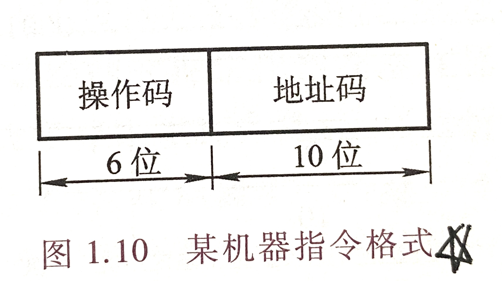
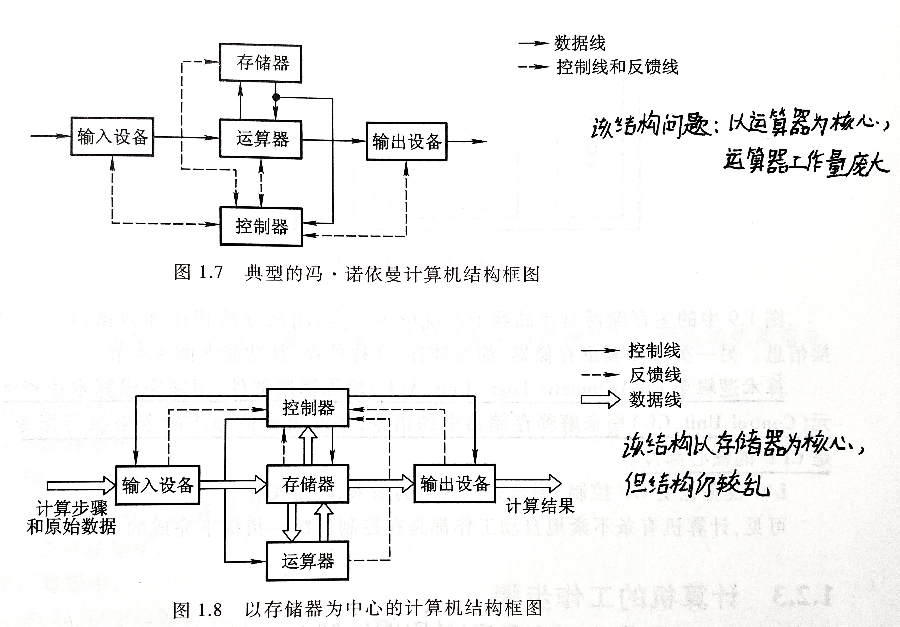
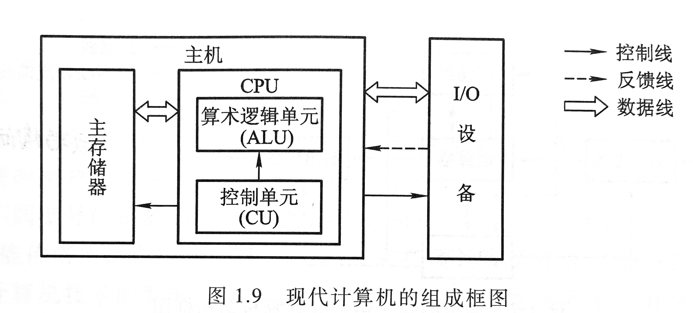
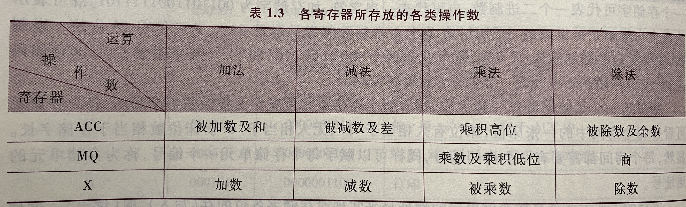

计算机组成原理

[TOC]

# 第一章 计算机系统概论
## 计算机系统构成
* 软件
	* 系统软件：
		1.标准程序库
		2.语言处理程序
		3.操作系统
		4.数据库管理系统
		5.网络软件
		...
	* 应用软件

* 硬件

## 计算机系统层次结构
* 第四级  虚拟机器M4（高级语言机器）  用编译程序翻译成汇编语言程序
* 第三级  虚拟机器M3（汇编语言机器）  用汇编语言翻译成机器语言程序
* 第二级  虚拟机器M2（操作系统机器）  用机器语言解释操作系统
* 第一级  传统机器M1（机器语言机器）  用微程序解释机器指令
* 第零级  微程序机器M0（微指令系统）  由硬件直接执行指令

## 计算机基本组成
### 冯·诺依曼计算机
特点：
* 计算机由运算器、存储器、控制器、输入设备、输出设备组成
* 指令和数据以同等地位存放于存储器内，并可按地址寻访
* 指令和数据均用二进制数表示
* 指令由操作码和地址码构成
>> 操作码表示操作的性质，地址码用来表示操作数在存储器中的位置
>> 操作码：表示机器所执行的各种操作
>> 地址码：表示参加运算的数存在存储器内的位置

* 指令在存储器内按顺序存放
* 机器以运算器为中心，输入输出设备与存储器间的数据传送通过运算器完成

### 计算机的硬件框图

* 中央处理器（CPU）:运算器和控制器在逻辑关系和电路结构上联系紧密， 往往集成在同一芯片上，通常将它们合起来统称为中央处理器
>> 现代计算机可认为由三部分组成：CPU、I/O设备、主存储器（MM）
> 

* I/O设备（又称外部设备）：即输入设备和输出设备
* 主机：CPU与主存储器的合称

* 算术逻辑单元（ALU）：简称算逻部件，用来完成算数逻辑运算
* 控制单元（CU）：用来解释存储器中的指令，并发出各种操作命令来执行指令
* 主存储器（主存/内存）：包括存储体M，各种逻辑部件、控制电路......
	1. 每个主存储器由若干存储单元组成，每个存储单元又包括若干存储元件
	2. 每个存储元件能寄存一位二进制代码0或1，每个存储单元能存储一串二进制代码 （该二进制代码称“存储字”，该二进制代码的位数称“存储字长”）
	3. 为了实现访存，主存中需配置MAR和MDR
	> 存储器地址寄存器（MAR）：存放欲访问的存储单元的地址，其位数对应存储单元的个数

	> 存储器数据寄存器（MDR）：存放从存储体某单元取出的代码或者准备送往某存储单元存入的代码， 其位数与存储字长相等

* 运算器：包括至少三个寄存器和一个算术逻辑单元（ALU）
	1. ACC（累加器）
	2. MQ（乘商寄存器）
	3. X（操作数寄存器）
	

### 计算机工作步骤
前提：该实际问题能用计算机解决
步骤：
* 建立数学模型
* 确定计算方法
* 编制解题程序

# 第六章 计算机运算方法
## C语言中强制类型转换
注意：ANSI C中定点整数是用“补码”存储的
* 无符号数与有符号数——不改变数据内容，改变解释方式
* 长整数变短整数——高位截断，保留低位
* 短整数变长整数——符号拓展（注意，由于是补码形式，负数进行拓展时于符号位和数值位之间补1，正数拓展补0）

## 数据存储和排列
### 大小端模式——主存中存储单元地址的分配
多字节数据在内存里一定是占连续的几个字节：
* 最高有效位(MSB)——左侧
* 最低有效位(LSB)——右侧

两种存储模式：
* 大端模式（大尾模式）——最高有效位在内存低地址，便于人类阅读
* 小端模式（小尾模式）——最高有效位在内存高地址，便于机器处理

两种对齐方式：
> 现代计算机通常按字节编址（每个字节对应一个地址）

> 通常也支持按字、半字、字节寻址 

1. 边界对齐——访问一个字/半字都只需要一次访存 （可能牺牲空间来换取更快的访存速率）
2. 边界不对齐——访问一个字/半字可能需要两次访存

# 第四章 存储器
## 层次结构
* 高速缓存（Cache）
* 主存储器（主存、内存）
> 注：cache与主存可以由cpu直接调用

* 辅助存储器（辅存、外存）

## 分类
### 按层次结构
* 同上

### 按存储介质
* 半导体存储器
* 磁表面存储器
* 光存储器

### 按存取方式
* 随机存取存储器RAM
	* 如内存
* 顺序存储器SAM
	* 如磁带
* 直接存取存储器DAM
	* 如磁盘
* 相连存储器（按内容访问）
	* 如快表

### 按信息可更改性
* 读/写存储器
* 只读存储器ROM

### 断电后信息是否丢失
* 易失性存储器
	* 如内存、cache
* 非易失性存储器
	* 如磁盘、光盘
### 信息读出后，原信息是否被破坏
* 破坏性读出
	* 如DRAM
* 非破坏性读出
	* 如SRAM、磁盘

## 存储器性能指标
1. 存储容量=存储字数\*存储字长
2. 单位成本（等位价格）=总成本/总容量
3. 数据传输率（主存带宽）=数据的宽度/存储周期
> 注："存储周期"与"存取时间"并不相同，存储周期=存取时间+恢复时间

## 主存储器基本组成
### 基本元件
1. MOS管
	* 作为通电开关
2. 电容
	* 存储电荷（即存储二进制0/1)

### 存储芯片结构
* 译码驱动电路
	* 译码器将地址信号转化为字选通线的高低电平
* 存储矩阵（存储体）
	* 由多个存储单元构成
		* 存储单元数目对应地址线位数所对应的选通线数目
	* 每个存储单元由多个存储元构成
		* 存储单元内存储元数目对应数据线位数（即一个"字"）
* 读写电路
	* 每次读/写一个存储字
* 地址线
* 数据线
* 片选线
* 读写控制线（可能分为1根，也可以是2根）
> 注：存储芯片的描述：总容量=存储单元个数\*存储字长，如8k\*8位表示2^13\*8bit的存储芯片

### 寻址
* 现代计算机通常按**字节编址**，即每个字节对应一个地址
* 但是也可支持按字节寻址、按字寻址、按半字寻址、按双字寻址

## SRAM与DRAM
### SRAM与DRAM基础结构
栅极电容
MOS管
触发器

### DRAM的刷新
* 刷新周期
	* 一般为2ms
* DRAM常采用重合法（有行、列译码器），使集成度下降
* 每次刷新以行为单位，每次刷新一行存储单元
* 刷新方式
	1. 分散刷新
		* 每次读写完都刷新一行
	2. 集中刷新
		* 该模式有有段时间为"死时间"(又称"死区"，该时间段内进行集中刷新操作，无法访问存储器)
	3. 异步刷新（可以在译码阶段刷新）
		* 2ms内每行刷新1次即可

### DRAM地址线复用技术
* 采用重组法设计地址线，降低集成度（有行、列译码器）
* 行、列地址分两次进行传送（分别传送给行、列缓冲器，再给译码器），可以使地址线更少，芯片引脚更少

### DRAM与SRAM比较汇总
|类型特点|SRAM|DRAM|
|---|---|---|
|存储信息|双稳态触发器|栅极电容|
|破坏性读出|非|是|
|读出后需要重写？（再生）|不用|需要|
|运行速度|快|慢|
|集成度|低|高|
|发热量|大|小|
|存储成本|高|低|
|易失/非易失行存储器？|易失（断电后信息消失）|易失（断电后信息消失）|
|需要刷新？|不需要|需要|
|送行列地址|同时送|分两次送|
|用途|常用作cache|常用作主存（其实现在常用的是SDRAM）|

## 只读存储器ROM（Read-Only Memory）

### 掩膜式只读存储器MROM（Mask Read-Only Memory）
* 制成后任何人不可重写
* 可靠性高、灵活性差、生产周期长、只适合批量定制

### 可编程只读存储器PROM（Programmable Read-Only Memory）
* 一次性编程的只读存储器

### 可擦除可编程只读存储器EPROM(Erasable Programmable Read-Only Memory)
* 允许用户写入信息，之后用某种方法擦除数据，可进行多次重写
	* UVEPROM
		* 用紫外线照射8-20min，可擦除**所有**信息，但擦除时间长，不能对单个单元进行单独擦除
	* EEPROM
		* 可用"电擦除"的方式，擦除**特定的字**

### 闪速存储器Flash Memory
* 由EEPROM发展来，断电后依旧能保存信息（非易失性），可进行多次快速擦除重写
> 注：由于闪存需要先擦除再写入，故"写"速度比"读"速度更慢

### 固态硬盘SSD
* 由控制单元+存储单元（Flash）组成，可进行快速多次擦除重写
* 与闪存的核心区别在于控制单元不同，存储单元介质类似

## 主存储器与cpu的连接
### 单块存储器与cpu的连接
### 多块存储器与cpu的连接——存储容量扩展
* 存储芯片基本结构
	1. 译码驱动电路
	2. 存储矩阵
	3. 读写电路
	4. 地址线、数据线、片选线、读写控制线
* 位扩展
	* 增加存储字长，使与数据总线的位数对应（即使数据总线宽度=存储字长）
* 字扩展
	* 增加存储字的数量
	* 方法
		1. 线选法
		2. （译码）片选法
			* 译码器的使用
			* 分析地址空间
* 字-位同时扩展
* 译码器（命名方式：n-2^n译码器）
	* 输入端	n条线
	* 输出端	2\^n条线，对应2\^n个片选信号
	* 74ls138译码器
		* 输入端3条线
		* 输出端2^n条线
		* 使能端EN（单个）/多个使能G1、G2A、G2B （G2端需要同时输入低电平信号，G1需要高电平信号才能选通）
			* 可通过cpu待地址信号稳定后， 输出的MERQ信号（主存请求信号Memory request）作用于G2B，使该译码器工作
			* 即cpu可使用译码器使能端控制片选信号的生效时间

## 提高访存速度（主存）的措施
### 存储周期T=存取时间r+恢复时间
### 双口RAM
* 支持两个CPU同时访问RAM
* 特点
	1. 可同时读/写不同的存储单元
	2. 可同时读同一个存储单元
	3. 不能同时写（或者一读一写）同一个单元
* 若发生冲突，则发出BUSY信号，其中一个CPU的访问端口暂时关闭

### 多模块存储器
* 单体多字存储器
	* 每次并行读出m个连续的字
	* 总线宽度也要拓展为m个字
* 多体并行存储器
	* 高位交叉编址
		* 理论上可以多个存储体被并行访问，但由于 常会连续访问，因此实际效果相当于单纯扩容
	* 低位交叉编址
		* 当存储模块数m>=T/r时，可使流水线不间断, 此时连续取n个存储字耗时T+（n-1）r
		* 每个存储周期内可读写连续的m个字
		* 微观上，m个模块被串行访问； 宏观上，每个存取周期内所有模块被并行访问

## 外存储器
### 磁盘存储器
* 磁盘原理
	* 磁盘设备组成
		* 存储区域：磁头、柱面、扇区
		* 磁盘存储器：磁盘驱动器、磁盘控制器、盘片
	* 性能指标
		* 容量：格式化与非格式化
		* 记录密度：道密度、位密度、面密度 （注：磁盘所有磁道记录的信息量是**相等的**，故最内侧磁道位密度最高，是决定因素）
		* 平均存取时间=寻道时间+旋转延迟时间+传输时间
		* 数据传输率
	* 磁盘地址：驱动器号|柱面（磁道）号|盘面号|扇区号
	* 磁盘工作过程
		1. 寻址
		2. 读盘/写盘
			1. 取控制字
			2. 执行控制字
		> 注：磁盘读写操作为串行方式， 故需要有串并转换电路才能处理与CPU交互的信息

* 磁盘阵列RAID
	* 基本思想：利用磁盘链接的特点提高存储性能、可靠性和安全性
	* RAID0：条带化，提高存储速度，但没有容错能力
	* RAID1：镜像磁盘互为备份，但容量减少一半
	* RAID2-5：通过数据校验提高容错能力

## SSD
### 原理
* 基于闪存技术Flash Memory，本质为电可擦除只读存储器EEPROM
### 组成
* 闪存翻译层——负责翻译逻辑块号，找到对应页Page
* 存储介质：多个闪存芯片
	* 每个芯片保罗若干"块"（block）
		* 每个块包含若干"页"（page）
### 读写性能特性
* 以页（page）为单位读/写——相当于磁盘的扇区
* 以块（block）为单位"擦除"，擦干净的块，其中每页都可以写一次、读无限次
* 支持随机访问（因为由电路直接控制）, 系统给定一个逻辑地址，闪存翻译层可以通过电路迅速定位到对应的物理地址
* 读快、写慢
	* 如果要写的页有数据，则不能写入，需要将整个块内其他页的数据全部复制到一个新的（擦除干净）的块中， 再写入新的页，地址可由闪存翻译层映射过去（逻辑地址对应新的物理地址）
### 磨损均衡技术
* 思想与目的：将"擦除"平均分布到各个块上，以提升使用寿命
* 动态磨损均衡：写入数据时，优先选择累计擦除次数少的新闪存块
* 静态磨损均衡：SSD监测并自动进行数据分配、迁移，让老旧的闪存块承担以读为主的储存任务，让较新的闪存块承担更多的写任务

### 与机械硬盘的比较
* SSD读写速度快，随机访存性能高，用电路控制访存位置 机械硬盘通过移动磁臂旋转磁盘控制访问位置，有寻道时间和旋转延迟
* SSD安静无噪音，耐摔抗震，能耗低，造价贵
* SSD的一个块诶擦除次数过多可能会坏掉

## Cache概念和基本原理
### Cache
* 实质为SRAM，成本高，空间小，速度快
* 封装于CPU内部
### 为什么要使用Cache
* 主存DRAM速度跟不上CPU
* 局部性原理
	* 空间局部性
	* 时间局部性
### 性能分析
* 命中率H
* 缺失（未命中）率M=1-H
* Cache-主存系统平均访问时间t\[tc为访问一次Cache所需时间，tm为访问一次主存所需时间\]
	1. 若先访问Cache，未命中再访问主存
		* t=Htc+（1-H）（tc+tm）
	2. 同时访问Cache和主存，若命中则立即终止访问主存
		* t=Htc+(1-H)tm

### cache与主存的数据传输问题
* 将主存的存储空间分块，主存与Cache以"块"为单位进行数据交换
* 主存地址=块号+块内地址
> 注：主存的块也可称"页/页面/页框"，Cache中的块也称"行"

## Cache-主存映射
### Cache中存储的信息格式
* 有效位（0/1）+标记+ 整块数据（内存中相应位置数据的副本）
* "标记"用于指明对应的内存块， 不同的映射方式，"标记"的位置不同
> 注意：每个Cache块（即Cache行）的位数与主存块的大小相等

### 全相连映射
* 主存快可以放到Cache的任意位置
* 主存地址结构
	* 标记（整个主存块号）+块内地址
* 优点：Cache存储空间利用充分，命中率高 缺点：查找标记最慢，有可能要对比所有行的标记

### 直接映射
* 主存块只能放到特定的某个Cache行
	* 行号=主存块号\%总行数
* 主存地址结构
	* 标记（主存块号前几位）+行号（主存块号末几位）+块内地址
* 优点：对于任意一个地址，只需要对比一个"标记"，速度最快 缺点：Cache存储空间利用不充分，命中率低

### 组相连映射
* 主存块可以放到特定分组的任意位置
	* 所属组号=主存块号%总组数
* 主存地址结构
	* 标记（主存块号前几位）+组号（主存块号末几位）+块内地址
* 优点：前两种方式的折中，综合效果好
> 术语：n路组相连映射——每n个Cache行为一组

### cpu寻找数据的流程
1. 需要寻找的数据位于主存块的位置（对应主存块的标记）
2. 根据相应的映射方式，选择不同方式确定cache行
3. 匹配cache标记与数据所在主存块标记，是否命中
4. 未命中则访问主存

## Cache替换算法
* 只会运用到全相连映射方式和组相连映射方式中
### 随机算法（RAND）
* 随便选一个主存块替换
* 由于过于随机，故效果很差
### 先进先出算法（FIFO）
* 优先替换最先被调入Cache的主存块
* 硬件实现简单，但不遵循局部性原理，效果差
### 近期最少使用（LRU）
* 将最久没有被访问过的主存块替换，每个Cache行设置一个"计数器"，用于记录多久没有被访问
* 基于局部性原理，近期被访问过的主存块在不久的将来也有可能被再次访问， 因此，淘汰最久没有被访问过的块是合理的 LRU算法实际运行效果优秀，Cache命中率高
### 最不经常使用(LFU)
* 将被访问次数最少的主存块替换，每个Cache行设置一个"计数器"，用于记录被访问过多少次
* 曾经被经常访问的主存块在未来不一定会用到，LFU实际运行效果不太好

## Cache写策略
> 每次被访问的主存块一定会被立即调入Cache

### 写命中时
* 写回法(write-allocate)
	* 当CPU对Cache写命中时，只修改Cache中相应的数据，而不立即写入主存， 只有当此块被换出时才写回主存
* 全写法(写直通法，write-through)
	* 当CPU对Cache写命中时，必须把数据同时写入Cache和主存， 一般使用写缓冲(write buffer)

### 写不命中时
* 写分配法
	* 当CPu对Cache写不命中时，把主存中的块调入Cache，在Cache中修改 通常搭配**写回法**使用
* 非写分配法
	* 当CPU对Cache写不命中时，只写入主存，不调入Cache 通常搭配**全写法**使用

### 多级Cache
* 现代计算机通常采用多级Cache结构
* 各级Cache常采用"**全写法+非写分配法**"
* Cache和主存间常采用"**写回法+写分配法**"

# 指令系统
## 指令格式
### 指令=操作码+地址码
* 其中，地址码可能有0-4个
### 分类
* 按地址码数目
	* 零/一/二/三/四地址指令
* 按指令长度
	* 指令字长概念
	* 定长指令字结构
	* 变长指令字结构
* 按操作码长度
	* 定长操作码
	* 可变长操作码
* 按操作类型
	* 数据传送类
		* CPU、主存之间的数据传送
	* 运算类
		* 算数逻辑操作、移位操作
	* 程序控制类
		* 改变程序执行流，如转移、陷阱与陷入指令
	* 输入输出类
		* CPU、I/O设备之间的数据传送
## 定长操作码与扩展操作码（不定长操作码）
### 定长操作码
* 在指令字的最高位部分分配固定的若干位（定长）表示操作码
* 一般n位操作码字段的指令系统最大能够表示2^n条指令
* 优点：简化计算机硬件设计，提高指令译码和识别速度
* 缺点：指令数量增加会占用更多固定位，留给表示操作数地址的位数受限
### 扩展操作码（不定长操作码）
* 全部指令的操作码字段的位数不固定，且分散地放在指令字的不同位置上。指令可以具有不同长度的操作码，从而在满足需要的前提下，有效缩短指令字长
* 优点：在指令字长有限的前提下仍能保持比较丰富的指令种类
* 缺点：增加了指令译码和分析的难度，使控制器的设计复杂化
* 设计扩展操作码注意点：
	* 不允许短码是长码的前缀
	* 各指令的操作码一定不能重复

## 指令寻址
### 指令执行过程
1. 取指令
2. 执行指令
### 什么是指令寻址
* 确定下一条要执行的指令的存放地址
* 由程序计数器PC指明
### 顺序寻址
* 每次取指令结束后，PC+"1" [注：此处的"1"要理解为一个指令字长]
* 注意，此时执行取出的指令，而PC已指向下一条指令
### 跳跃寻址
* 执行转移类指令导致的PC的值改变

## 数据寻址
### 区别
* 指令寻址
	* 下一条欲执行指令的指令地址（由PC给出）
* 数据寻址
	* 确定本条指令的地址码指明的真实地址
### 寻址方式
* 直接寻址
* 间接寻址
* 隐含寻址
* 寄存器寻址
* 寄存器间接寻址
* 立即寻址
* 隐含寻址
* 偏移寻址
	* 基址寻址
	* 变址寻址
	* 相对寻址
* 堆栈寻址

## x86汇编语言基础
### 指令的作用
1. 改变程序执行流
2. 处理数据

### 数据的寻找
* 寄存器
	* 通用寄存器：eax、ebx、ecx、edx
	* 变址寄存器：esi、edi
	* 堆栈寄存器：ebp、esp
* 主存：汇编指令中，需要给出读写长度、主存地址
	* dword ptr[地址]  #32bit
	* word ptr[地址]   #16bit
	* byte ptr[地址]   #8bit
* 指令中（立即数）：汇编指令中可直接给出常量，可用十进制表示、十六进制表示（以h结尾）

### mov 指令
* mov 目的操作数d,源操作数s
* 将源操作数s复制到目的操作数d所指的位置

### 指令
