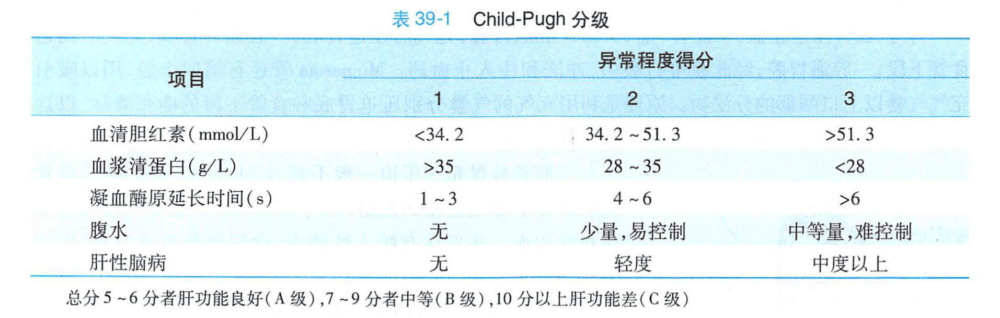

外科学
# 外科学
[TOC]
## 门静脉高压
### 解剖学基础
* 门静脉正常压力13-24cmH2O，平均18cmH2O
* 门静脉压力>25cmH2O即门脉高压，多数病例可上升至30-50cmH2O
* 门静脉系统位于两个毛细血管网之间，该静脉系统无瓣膜
* 门静脉主干是
    1. 肠系膜上、下静脉
    2. 脾静脉
* 门静脉与腔静脉系统的四个交通支
    1. 胃底、食管下交通支（最重要，门脉高压时易曲张、破裂，导致大出血）
    2. 直肠、肛管下交通支
    3. 前腹壁交通支
    4. 腹膜后交通支

### 病理生理

|分类|病因|
|---|---|
|肝前型|肝外门静脉血栓形成、先天性畸形、外在压迫|
|肝内型|肝窦和窦后阻塞性——肝炎肝硬化（我国最常见） 窦前阻塞性——血吸虫病|
|肝后型|巴德-吉利亚综合征、缩窄性心包炎、严重右心衰|

### 临床表现&体征
||解释|
|---|---|
|1.呕血或便血|系食管胃底静脉曲张破裂|
|2.疲乏、嗜睡、厌食、肝病面容、蜘蛛痣、肝掌、男性乳房发育、睾丸萎缩、出血不易停止、肝性脑病|肝功能不良（非特异性全身表现）|
|3.视诊：黄疸、腹水、前腹壁静脉曲张|门脉高压严重|
|4.体检：触及脾脏 早期肝硬、边缘顿、不规则；晚期肝缩小不能触及（肝硬化导致）|提示门脉高压|

### 辅助检查
|类型|特殊结果|解释|
|---|---|---|
|血常规|血细胞计数下降 常见白细胞<3\*10^9，血小板（70-80）\*10^9|脾亢进|
|肝功能检查|血浆白蛋白下降、球蛋白增高（白球比例倒置） 凝血酶原时间延长（凝血因子减少）||
|腹部超声|child分级||
|x线钡餐、内镜|钡剂充盈时——食管虫蚀样改变 钡剂排空时——蚯蚓样、串珠样改变||
|ct、MRI|||

### 治疗
1. 针对食管胃底静脉曲张破裂出血
    * 非手术治疗
        * 适应症：一般情况不良、肝功能较差、难以耐受手术者（child C级）
        * 药物治疗：

        |目的|药物|
        |---|---|
        |止血|血管收缩药：三甘氨酰赖氨酸加压素、生长抑素|
        |预防感染|广谱头孢|
        |其他||

        * 内镜治疗——控制急性出血首选
        * 三腔管压迫止血——紧急情况下暂时控制出血，一般不超过24h
        * 经颈静脉肝内门体分流术（TIPS)
    * 手术治疗
        * 适应症：一般情况尚可、肝功能较好、估计能耐受手术者（child A/B级）
        * 手术时机：

